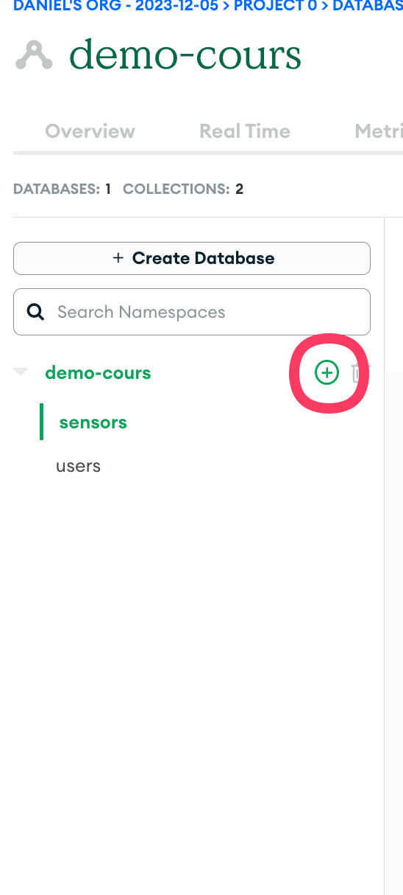
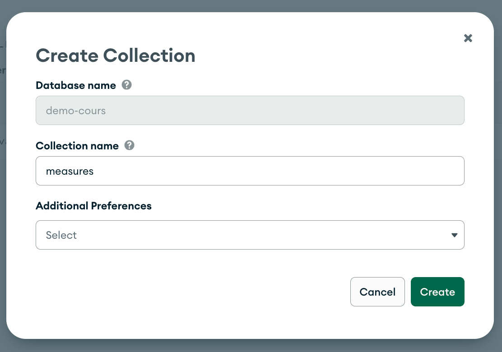
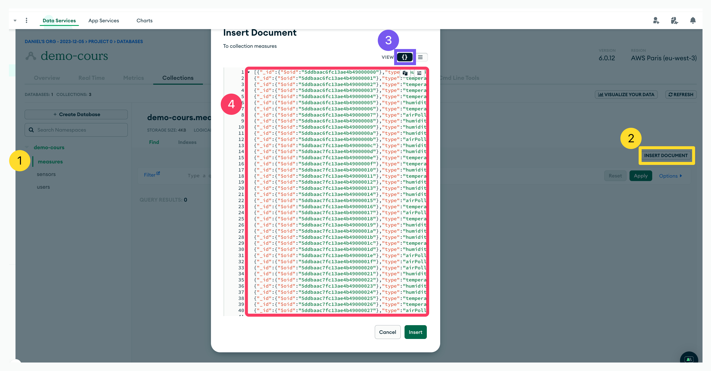

1. Créez une base de donnée que vous appelerez DashboardProject
2. Créer les trois collections (Users,Sensors et Measures) 
 
 
1. Sélectionner la collection dans laquelle vous souhaitez importer de la donnée
2. Faites un copier coller des fichiers JSON 

 

3. Répetez les etapes 4) à 6) pour les trois collections
4. Votre base de données est prête!